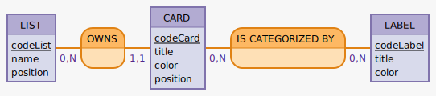

# MCD

Le but du MCD c'est de décrire les entités qu'on va manipuler et leurs attributs. Il devra présenter les relations entre ces entités. Ainsi derrière on pourra en déduire une implémentation pour notre SGBD (mais attention à pas encore à ce stade, ça reste conceptuel, pour ça qu'on ne parle pas encore de table ou de clé ou de champ, mais d'entité et d'attributs).

