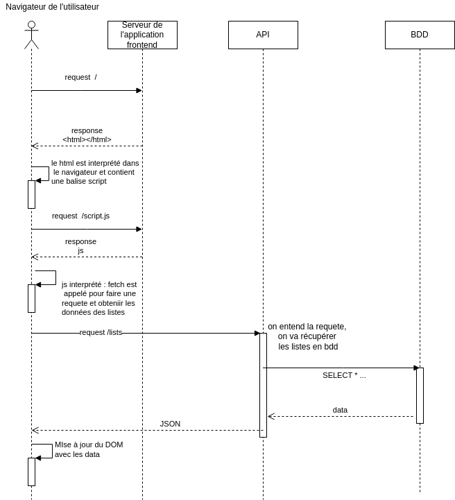

# Diagramme de séquence

Un diagramme de séquence est une manière de schématiser graphiquement un processus / un scénario qui s'étale dans le temps et qui fait intervenir différents acteurs

Par exemple ça peut être utiiser pour visualiser le parcours d'une requete jusqu'à la réponse. Mais pas que : ça peut aussi représenter n'importe quel scénario comme un client qui va au resto.

Symboles utilisés :

- bonhomme baton : utilisateur d'un système
- boites rectangles : les acteurs
- les lignes de vie : les traits qui partent des acteurs et qui descendent, représentant le temps qui passe de haut en bas
- les boites d'activation : les rectangles sur la ligne de vie d'un acteur, il se passe qqch, une tâche qui dure dans le temps
- les flèches : un message / une intéraction
  - flèches pleines : message synchrone (on attend la réponse pour continuer)
  - flèches pointillées : message asynchrone (on n'attend pas la réponse pour continuer)

Le diagramme de séquence fait partie d'UML (Unified Modeling Language / Langage de modélisation unifié), c'est une manière standard / normée de représenter schématiquement un système.

